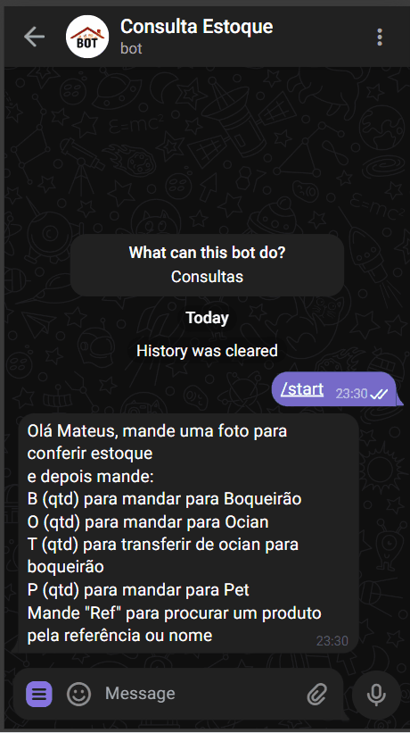
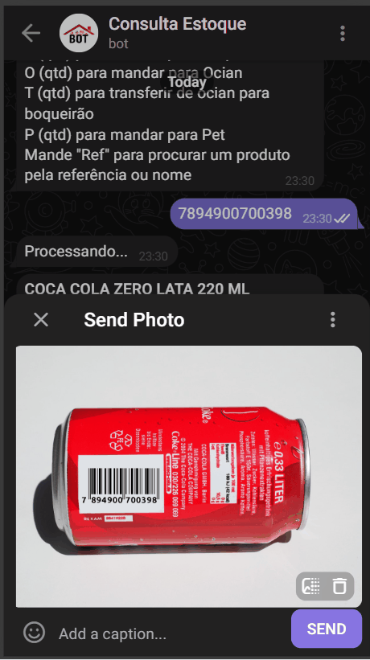
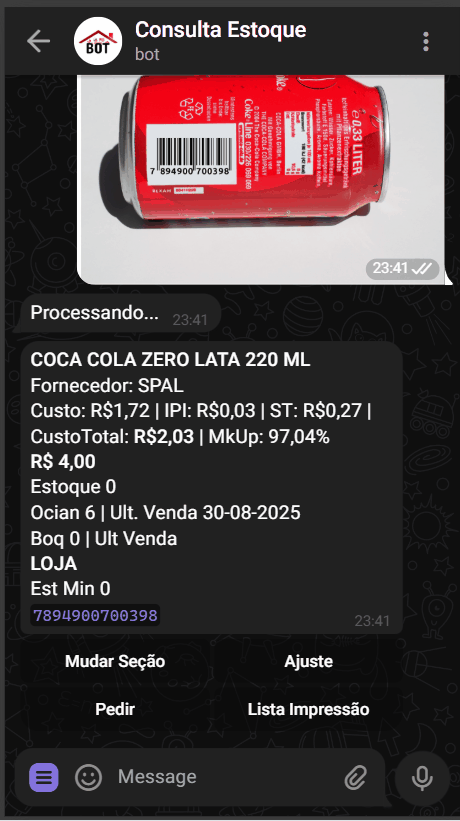

# 📦 ConsultaEstoqueBot  

Um **bot de Telegram** desenvolvido em Python para auxiliar na **gestão de estoque e pedidos**, integrado a um **banco de dados SQL** para manter as informações sempre atualizadas.  

> ⚠️ Este repositório contém apenas **demonstrações visuais** e descrição técnica.  
> O código completo é privado. Caso queira ver detalhes técnicos, entre em contato comigo.  

---

## 🚀 O que o bot faz  

- 🔍 Consulta produtos por **código de barras, referência ou nome**  
- 🖼️ Reconhece **códigos de barras em imagens** enviadas pelo Telegram  
- 📊 Gera relatórios em **Excel** com base nos dados do banco  
- 📝 Cria listas de pedidos por seção, nota fiscal ou marca  
- 📦 Permite transferências entre locais *(Estoque ⇄ Boqueirão ⇄ Ocian ⇄ Pet)*  
- 🖨️ Imprime etiquetas diretamente em impressoras térmicas  
- 🔒 Autentica usuários e controla permissões  
- 🔔 Envia **alertas automáticos** para reposição de produtos com venda rápida  
- 🗄️ Integração direta com **Firebird SQL** para consultas de estoque e notas fiscais  

---

## 📸 Demonstração  
### 🔍 Consulta de produto por código digitado
  

### 🖼️ Consulta de produto foto
  

### 📦 Pedido automatizado  
  

---

## 🛠️ Tecnologias  

- **Python 3**  
- **python-telegram-bot** (interação no Telegram)  
- **Firebird SQL** (consulta de dados do estoque e vendas)  
- **openpyxl / pandas** (manipulação e análise de planilhas)  
- **pyzbar + Pillow** (leitura de códigos de barras em imagens)  
- **threading / glob / regex** (concorrência e processamento de arquivos)  

---

## ⚙️ Como foi construído  

- Conexão ao **banco de dados Firebird** para obter informações de estoque, notas fiscais e vendas  
- Geração de relatórios e pedidos usando **consultas SQL + Python**  
- Estrutura modular (consultas, relatórios, comandos do bot)  
- Persistência de dados auxiliares em arquivos (`.txt`, `.xlsx`) para integração com sistemas já existentes  
- Rotinas agendadas com **JobQueue** (ex.: checar marcas com alta saída diariamente)  

---

## ✨ Aprendizados do Projeto  

- Integração entre **Python e Firebird SQL** para automação de consultas  
- Construção de fluxos complexos de interação no Telegram  
- Manipulação de **Excel** e geração de relatórios automáticos  
- Criação de automações que reduzem esforço manual no controle de estoque  
- Boas práticas de autenticação, logs e organização de dados  

---

## 👨‍💻 Autor  

Desenvolvido por **Mateus Bastos**  
🔗 [LinkedIn](https://www.linkedin.com/in/mateus-bastos-825572139/) | [GitHub](https://github.com/teusbastos)